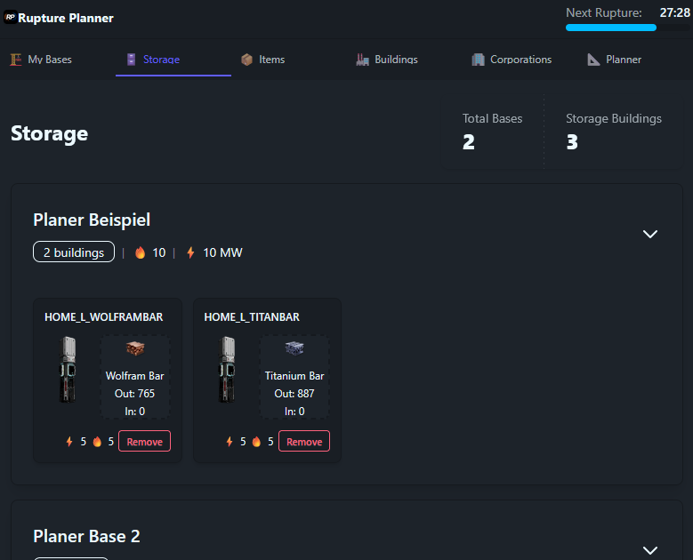
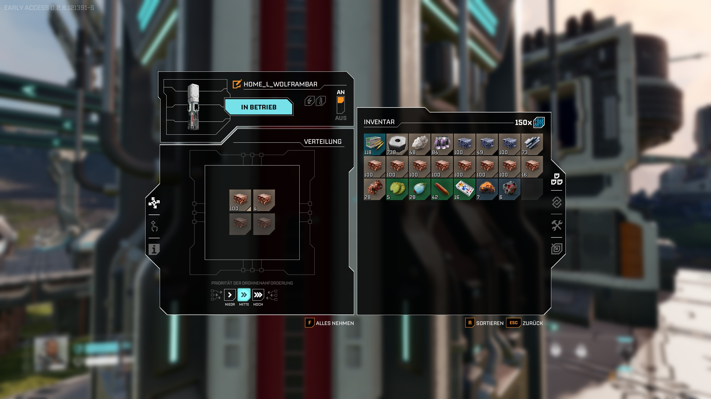
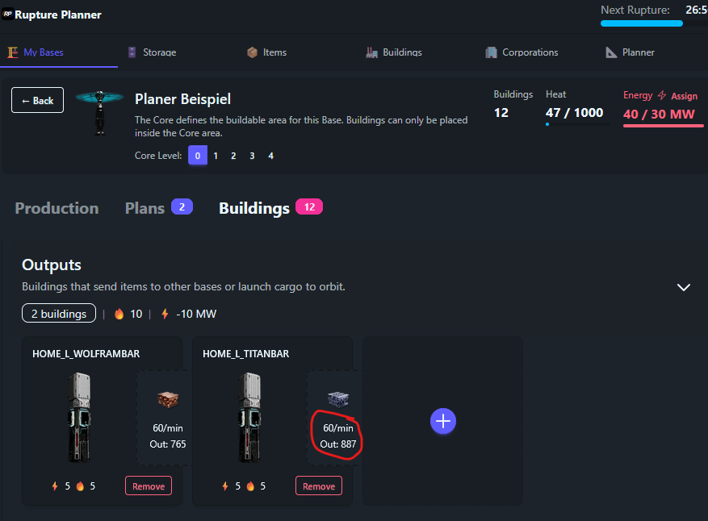
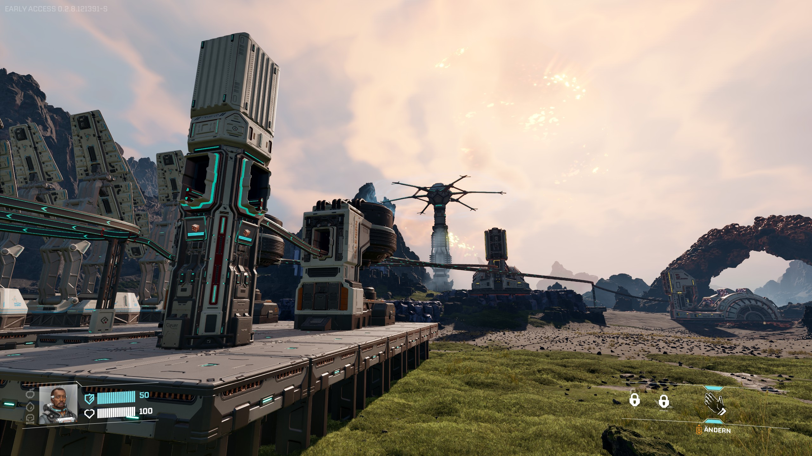

## Anleitung

### Starrupture SaveGome Ordner einrichten
 In der Datei "aveFileConverter/watcher.mjs" oben den Dateipfad mit Steam-UserID und Sessionname anpassen.

### Im Windows Terminal: 
Planer -> "npm run dev"
Planer + SaveGameWatcher -> "npm run dev:watcher"

### Wie gehts?
Das Tool kann die aktuellen Füllstände der Lager und Dispatcher anzeigen. Damit das funktioniert muss der CustomName des Gebäudes im Spiel und Planer gleich sein.

In My Bases -> Buildings

